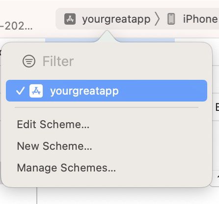
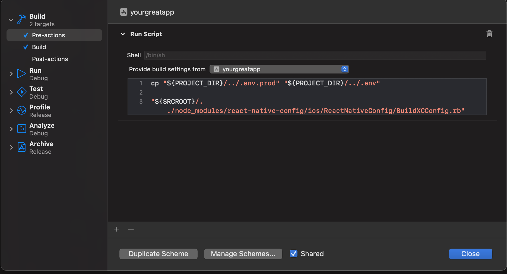
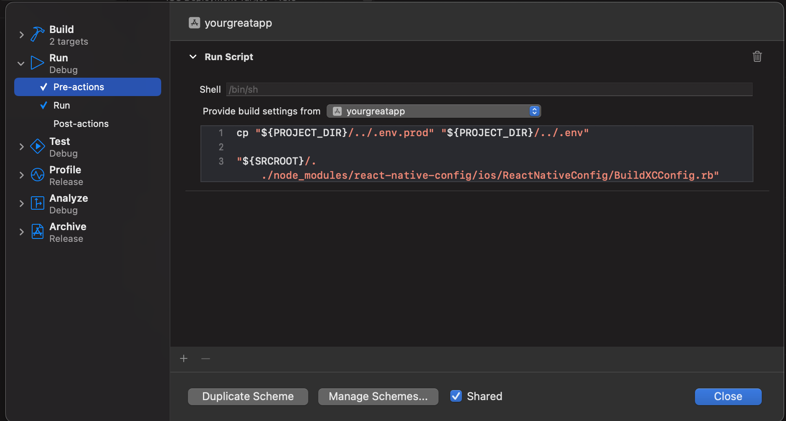
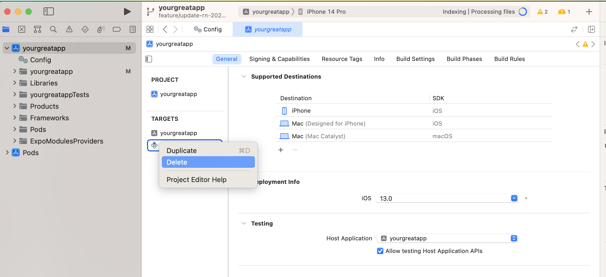
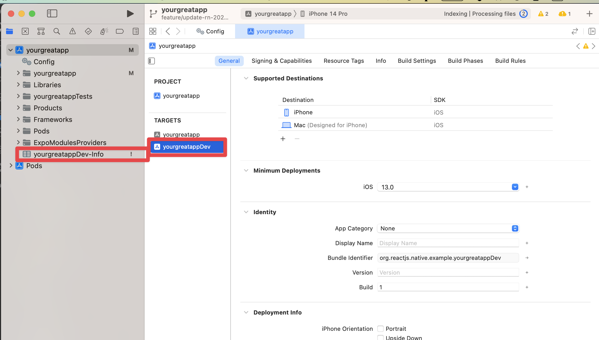
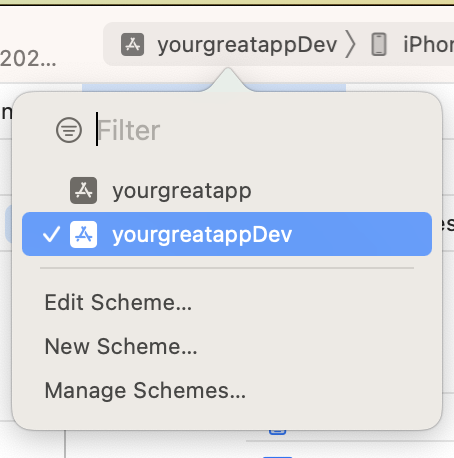
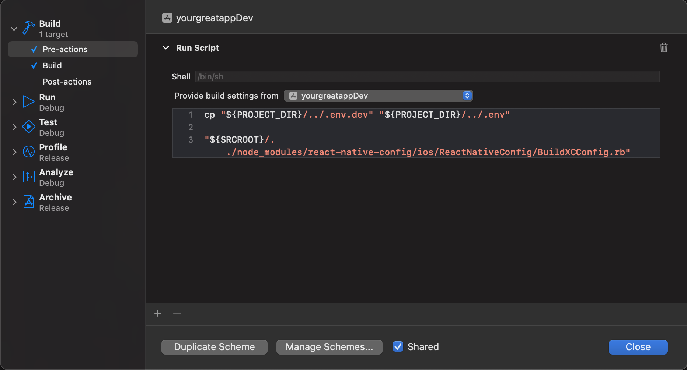
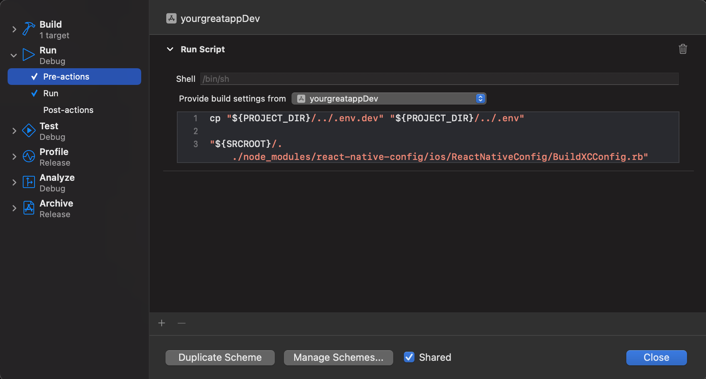
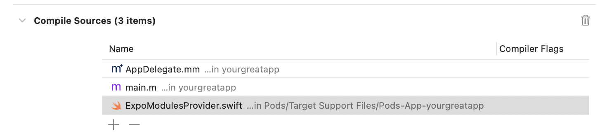

# How to update

You'd need to go through upating each part of the template one by one

> Before updating the dependencies, go to the [Drive](https://drive.google.com/drive/folders/14hkgjGxqG0YuWspWnLbEAHaW0FD2iqts) and copy envs. If you don't have envs in place - you wouldn't be able to test the update

## Root

Start by updating all the general dependencies reused across projects

1. `yarn add -D -W @typescript-eslint/eslint-plugin@latest @typescript-eslint/parser@latest babel-eslint@latest eslint@latest eslint-config-prettier@latest eslint-plugin-eslint-comments@latest eslint-plugin-prettier@latest eslint-plugin-sort-keys-fix@latest eslint-plugin-unused-imports@latest prettier@latest typescript@latest`

## App

Then, update react-native project here.
The approach here is to create another react-native project, add all the necessary dependencies, setup 2 environments, navigation, state management and make sure everything's in place

1. Rename `app` to `old_app`
2. Call `npx react-native init yourgreatapp --template react-native-template-typescript`
3. Rename `yourgreatapp` to `app`. Go to `app`
4. Remove yarn.lock
5. Install dependencies & install Pods
6. Remove `__tests__`
7. Copy `codegen.yml`, `example.env`, `tsconfig.json`, `.eslintrc.js` from `old_app` to `app`(replace if needed). Delete .prettierc.js
8. Copy `fastlane` folder
9. Copy `name`, `scripts` in `package.json` from `old_app` to `app`
10. Copy `metro.config.js` from `old_app` to `app`. run `yarn add -D react-native-monorepo-tools`
11. Add apollo: `yarn add @apollo/client apollo3-cache-persist subscriptions-transport-ws` inside `app` folder. Checkout with Apollo if something changed
12. Add codegen dev: `yarn add -D @graphql-codegen/cli @graphql-codegen/typescript-operations @graphql-codegen/typescript-react-apollo`
13. Add eslint: `yarn add -D eslint-plugin-react eslint-plugin-react-hooks eslint-plugin-react-native`
14. Add i18next: `yarn add i18next react-i18next`
15. Install expo modules: https://docs.expo.dev/bare/installing-expo-modules/
16. Install react-navigation: `yarn add @react-native-async-storage/async-storage @react-navigation/native-stack @react-navigation/native react-native-safe-area-context react-native-screens`
17. Add react-native-version. `yarn add -D react-native-version`
18. Add react-native-config: `yarn add react-native-config`
19. Don't forget to install pods once again ;)
20. Bring back `app/android/app/src/dev/res/values`
21. app/android/app/build.gradle:

- add `apply from: project(':react-native-config').projectDir.getPath() + "/dotenv.gradle"` after first line
- change `enableHermes: false` to `enableHermes: true`
- Add

```
project.ext.envConfigFiles = [
    dev: ".env.dev",
    prod: ".env.prod",
]

apply from: project(':react-native-config').projectDir.getPath() + "/dotenv.gradle"
```

after `apply from: "../../node_modules/react-native/react.gradle"`

- add `resValue "string", "build_config_package", "com.yourgreatapp"` in `android.defaultConfig`
- add

```
flavorDimensions "default"
    productFlavors {
        dev {
            dimension "default"
            applicationIdSuffix ".dev"
            versionNameSuffix "-dev"
        }
        prod {
            dimension "default"
        }
    }
```

to `android` object

21. Revise android-related code to make sure no changes are related `com.yourgreatapp` or `react-native-config`. If so, follow the steps once again or contact Nic
22. https://github.com/luggit/react-native-config#availability-in-build-settings-and-infoplist (steps 1-5)
23. `Xcode`

- yourgreatapp -> Edit Scheme
  
- Build -> Pre Actions -> + -> New Run Script Action

```
cp "${PROJECT_DIR}/../.env.prod" "${PROJECT_DIR}/../.env"

"${SRCROOT}/../node_modules/react-native-config/ios/ReactNativeConfig/BuildXCConfig.rb" "${SRCROOT}/.." "${SRCROOT}/tmp.xcconfig"

```

Choose "Provide build settings from" - your scheme



- Run -> Pre Actions -> + -> New Run Script Action

```
cp "${PROJECT_DIR}/../.env.prod" "${PROJECT_DIR}/../.env"

"${SRCROOT}/../node_modules/react-native-config/ios/ReactNativeConfig/BuildXCConfig.rb" "${SRCROOT}/.." "${SRCROOT}/tmp.xcconfig"
```

Choose "Provide build settings from" - your scheme



24. `Xcode`

- Targets -> remove yourgreatappTests



25. `Xcode`

- Targets -> yourgreatapp -> right click -> duplicate -> yourgreatappDev
- Find yourgreapp copy-Info.plist, rename to yourgreatappDev-Info.plist. Replace in finder 'yourgreatapp copy-Info.plist' to 'yourgreatappDev-Info.plist'
- XCode -> scheme -> manage schemes -> slow double click on yourgreatapp copy -> yourgreatappDev
- Change yourgreatappDev displayname to contain "Dev"




26. `Xcode`

- yourgreatappDev -> Edit Scheme
- Build -> Pre Actions -> + -> New Run Script Action

```
cp "${PROJECT_DIR}/../.env.dev" "${PROJECT_DIR}/../.env"

"${SRCROOT}/../node_modules/react-native-config/ios/ReactNativeConfig/BuildXCConfig.rb" "${SRCROOT}/.." "${SRCROOT}/tmp.xcconfig"

```

Choose "Provide build settings from" - your scheme



- Run -> Pre Actions -> + ->

```
cp "${PROJECT_DIR}/../.env.dev" "${PROJECT_DIR}/../.env"

"${SRCROOT}/../node_modules/react-native-config/ios/ReactNativeConfig/BuildXCConfig.rb" "${SRCROOT}/.." "${SRCROOT}/tmp.xcconfig"
```

Choose "Provide build settings from" - your scheme



27. Copy App.tsx, src folder from `old_app` to `app`
28. Change Podfile to have abstract target on top, remove \*Tests

Before:

```
target 'yourgreatapp' do
 ...

  target 'yourgreatappTests' do
    inherit! :complete
    # Pods for testing
  end
end
```

After:

```
abstract_target 'App` do

  ...

  target 'yourgreatapp' do
  end

  target 'yourgreatappDev' do
  end
env
```

29. Add missing files to gitignore(the one deleted in the bottom of the history)
30. `bundle add fastlane`
31. Troubleshooting - in case you face an issue `Expo Build in XCODE gives error: CompileSwiftSources normal arm64 com.apple.xcode.tools.swift.compiler` - make sure you open Xcode -> Build Phases -> Compile Sources, it doesn't contain any duplicates or dangling references

It should be something like this:



## Hasura

Here you only need to update the local dependencies. Also, You need to update the `Dockerfile` and `docker-compose-local` to make sure the versions are consistent

1. Install hasura dependencies: `cd hasura && yarn`
2. `yarn add -D hasura-cli@latest`. At this point you can go to `hasura/package.json` and see a new version. Suppose it's `2.15.1`

3. Update `hasura/Dockerfile` to use this version:
   For instance, before:

```Dockerfile
FROM hasura/graphql-engine:v2.6.1.cli-migrations-v3
```

After:

```Dockerfile
FROM hasura/graphql-engine:v2.15.1.cli-migrations-v3
```

4. Update `./docker-compose-local.yml`

For instance, before:

```yaml
graphql-engine:
  image: hasura/graphql-engine:v2.6.1
```

After:

```yaml
graphql-engine:
  image: hasura/graphql-engine:v2.15.1
```

5. Make sure it's working correctly by running `yarn console`(don't forget to setup docker-compose-local on root)

## API

Here you only need to update the libraries and make sure the api's running and you can call it from hasura

1. Install all dev dependencies: `yarn add -D @graphql-codegen/cli@latest @graphql-codegen/typescript@latest @graphql-codegen/typescript-graphql-request@latest @graphql-codegen/typescript-operations@latest @types/node@latest ts-node@latest`

2. Install all dependencies: `yarn add @humanwhocodes/env@latest apollo-server-core@latest apollo-server-express@latest class-validator@latest dotenv@latest express@latest graphql@latest graphql-scalars@latest i18next@latest reflect-metadata@latest type-graphql@latest`

3. Run the server: `yarn dev`, make sure api is accessible from `hasura`

## Web

The goal here is to call create-react-app once again, copy all the source files and make sure it works.
We don't want to simply update react's version because probably with a version dump something else also changes.

1. Rename `web` to `old_web`

2. Run `npx create-react-app web --template typescript`

3. Move `src` from `old_web` to `web` - Before doing it make sure you don't overwrite anything

4. Copy scripts, name from `old_web`'s `package.json` to `web`

5. Add missing dependencies `yarn add dotenv i18next-browser-languagedetector react-router-dom @apollo/client apollo3-cache-persist react-i18next`

6. Add missing dev dependencies: `yarn add -D eslint-plugin-react@latest eslint-plugin-react-hooks@latest @graphql-codegen/cli@latest @graphql-codegen/typescript@latest @graphql-codegen/typescript-operations@latest @graphql-codegen/typescript-react-apollo@latest`

7. Adjust gitignore(add `generated` there)

8. Move `tsconfig`, `.eslintrc.js`, `codegen.yml`, `Dockerfile`, `example.env` from `old_web` to `web`

9. (testing only) `yarn localize`

10. Make sure it works(`yarn start`)
